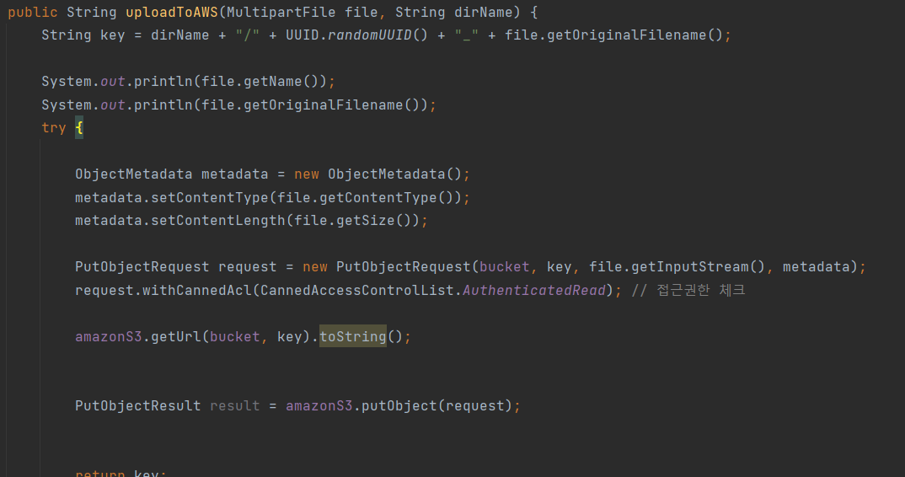

🎞7월 26일 

# S3에 파일 업로드를 위해 S3 학습

```
public class S3Service {

    private final AmazonS3 amazonS3;

    @Value("${cloud.aws.s3.bucket}")
    private String bucket;

    public String uploadToAWS(MultipartFile file) {
        String key = UUID.randomUUID() + "_" + file.getOriginalFilename();
        try {

            ObjectMetadata metadata = new ObjectMetadata();
            metadata.setContentType(file.getContentType());
            metadata.setContentLength(file.getSize());
            PutObjectRequest request = new PutObjectRequest(bucket, key, file.getInputStream(), metadata);
            request.withCannedAcl(CannedAccessControlList.AuthenticatedRead); // 접근권한 체크
            PutObjectResult result = amazonS3.putObject(request);
            return key;
        } catch (AmazonServiceException e) {
            // The call was transmitted successfully, but Amazon S3 couldn't process
            // it, so it returned an error response.
            log.error("uploadToAWS AmazonServiceException filePath={}, yyyymm={}, error={}", e.getMessage());
        } catch (SdkClientException e) {
            // Amazon S3 couldn't be contacted for a response, or the client
            // couldn't parse the response from Amazon S3.
            log.error("uploadToAWS SdkClientException filePath={}, error={}", e.getMessage());
        } catch (Exception e) {
            // Amazon S3 couldn't be contacted for a response, or the client
            // couldn't parse the response from Amazon S3.
            log.error("uploadToAWS SdkClientException filePath={}, error={}", e.getMessage());
        }

        return "";
    }

}

```

### 파일을 업로드 함.


### 성공은 됨. 하지만 intellij에서 region 오류가 남.


-- 잘 읽어보면 설정된 버킷의 region은 "ap-northeast-2"인데 왜 안 맞추냐는 것 같다.

### properties 와 동일하게 맞췄음에도 계속 오류가 나서 5시간째 헤매고 있다.

#### 내가 설정한 region 


#### 현재 버킷의 region 


-- 내일 코치님께 여쭤볼 생각...

🎞7/27

## 해결방법
-- 버킷설정을 처음부터 다시 해보니 어쩌다 되버렸다..

-- 나의 S3의 learners-high 


### 파일 다운로드
 

-- 아까는 잘 되더니 갑자기 에러가 났다. 아마 경로때문인거 같은데 차차 해결해봐야할거 같다.


## 🧨 우선, 중요한 것은 "폴더/폴더/파일" 을 임의로 설정해서 객체를 넣을 수 있는 것을 구현했다.

이런 식으로 파일들을 저장하려했다.

/class/수업no/썸네일/ 

/class/수업no/수업회차no/강의자료

/class/수업no/수업회차no/과제

/user


#### 1️⃣ 컨트롤러에서 원하는 경로를 service에 넘겨준다.


#### 2️⃣ 경로랑 넘겨받은 경로들을 이름이랑 getURL을 이용하여 설정하면 된다.


#### 3️⃣ 파일을 업로드 하면 이렇게 생성이되서 객체가 저장된다.


### 💥 오류 해결하다가 download오류를 해결했다.
##### ❌ 아까는 경로를 무시하고 그대로 "602dc39a-895d-4939-bb49-f9fc7300b600_ccute.png" 넣었더니 오류가 난 것 같다.
  
##### ⭕ 경로까지 모두 적어주니 다운로드가 잘 됐다.


